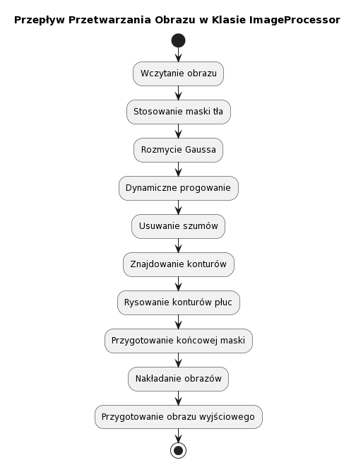

# Dokumentacja Klasy ImageProcessor

## Adres Repozytorium Git
Repozytorium kodu źródłowego dla Projektu `Analizator oraz zaciemniacz medycznych zdjęć rentgenowskich` można znaleźć pod adresem:
[GitHub - ImageProcessor](https://github.com/twoje-username/twoje-repozytorium)


## Przegląd
Klasa `ImageProcessor` jest przeznaczona do przetwarzania obrazów, szczególnie do zadań takich jak stosowanie rozmycia Gaussa, dynamiczne progowanie, usuwanie szumów, znajdowanie konturów oraz wykrywanie konturów płuc. Jest dostosowana do obrazów w skali szarości i zawiera funkcjonalność nakładania przetworzonych obrazów.

## Parametry Inicjalizacji
- `image_path` (str): Ścieżka do pliku obrazu wejściowego.
- `threshold_decrement` (int): Wartość dekrementu używana w dynamicznym progowaniu.
- `brightness_cutoff_percent` (int): Procentowy próg jasności w dynamicznym progowaniu.
- `iterations` (int): Liczba iteracji procesu dynamicznego progowania.
- `min_contiguous_pixels` (int): Minimalna liczba ciągłych pikseli do usuwania szumów.
- `blur_kernel_size` (tuple, domyślnie=(5, 5)): Rozmiar jądra używanego do rozmycia Gaussa.
- `noise_kernel_size` (tuple, domyślnie=(10, 10)): Rozmiar jądra używanego do usuwania szumów.
- `lung_contour_area_threshold` (int, domyślnie=7000): Próg powierzchni dla wykrywania konturów płuc.
- `black_bg_threshold` (int, domyślnie=110): Próg do identyfikacji czarnego tła.
- `overlay_alpha` (float, domyślnie=0.3): Wartość alfa dla nakładania obrazów.

## Metody Publiczne
- `load_image()`: Ładuje obraz z określonej ścieżki.
- `save_result(image, output_path)`: Zapisuje przetworzony obraz do podanej ścieżki wyjściowej.
- `show_result(image)`: Wyświetla przetworzony obraz.
- `get_histogram()`: Oblicza i zwraca znormalizowany histogram obrazu.
- `save_histogram(output_path)`: Zapisuje wykres i dane histogramu do określonej ścieżki.

## Metody Prywatne
_Metody prywatne są używane wewnętrznie i nie są przeznaczone do bezpośredniego dostępu._

- `apply_background_mask(image)`: Stosuje maskę tła do danego obrazu.
- `create_background_mask(image)`: Tworzy maskę tła dla obrazu.
- `apply_gaussian_blur()`: Stosuje rozmycie Gaussa na obrazie.
- `create_dynamic_threshold_image()`: Tworzy obraz z dynamicznym progowaniem.
- `remove_noise()`: Usuwa szum z obrazu binarnego.
- `find_contours()`: Znajduje i zwraca kontury w oczyszczonym obrazie.
- `draw_lungs_contours()`: Rysuje kontury płuc na obrazie.
- `prepare_final_mask()`: Przygotowuje końcową maskę dla obszaru płuc.
- `color_images()`: Konwertuje obrazy na format kolorowy dla wizualizacji.
- `apply_overlay()`: Nakłada przetworzone obrazy.
- `prepare_output()`: Przygotowuje końcowy obraz wyjściowy.

## Przykład Użycia
```python
processor = ImageProcessor(
    image_path="ścieżka/do/obrazu.jpg",
    threshold_decrement=5,
    brightness_cutoff_percent=50,
    iterations=1,
    min_contiguous_pixels=5,
    blur_kernel_size=(5, 5),
    noise_kernel_size=(10, 10),
    lung_contour_area_threshold=7000,
    black_bg_threshold=110,
    overlay_alpha=0.3
)
przetworzony_obraz = processor.output_image
processor.save_result(przetworzony_obraz, "ścieżka/do/wyjścia.jpg")
```

## Schemat Przepływu Przetwarzania Obrazu

Poniższy schemat blokowy przedstawia kolejne etapy przetwarzania obrazu przez klasę `ImageProcessor`.



### Opis Kroków Przetwarzania Obrazu

1. **Wczytanie Obrazu**:
   - Metoda `load_image()` wczytuje obraz z dysku za pomocą `cv2.imread`.
   - Obraz jest wczytywany w skali szarości (`cv2.IMREAD_GRAYSCALE`).
   - W przypadku niepowodzenia, zgłaszany jest wyjątek.

2. **Stosowanie Maski Tła**:
   - Metoda `apply_background_mask()` stosuje maskę tła do obrazu.
   - Jeżeli maska tła nie istnieje, jest tworzona przez `create_background_mask()`.
   - `create_background_mask()` wykorzystuje progowanie do oddzielenia tła od głównych elementów obrazu i tworzy maskę z największego konturu.

3. **Rozmycie Gaussa**:
   - `apply_gaussian_blur()` stosuje rozmycie Gaussa na obrazie z zastosowaną maską tła.

4. **Dynamiczne Progowanie**:
   - `create_dynamic_threshold_image()` tworzy obraz binarny z dynamicznie dostosowanym progiem.
   - Próg jest dostosowywany w każdej iteracji na podstawie średniej jasności pikseli.

5. **Usuwanie Szumów**:
   - `remove_noise()` stosuje operacje morfologiczne do usunięcia małych obiektów z obrazu binarnego.

6. **Znajdowanie Konturów**:
   - `find_contours()` lokalizuje kontury na oczyszczonym obrazie binarnym.

7. **Rysowanie Konturów Płuc**:
   - `draw_lungs_contours()` identyfikuje i rysuje kontury o powierzchni większej niż `lung_contour_area_threshold`.

8. **Przygotowanie Końcowej Maski**:
   - `prepare_final_mask()` tworzy maskę obejmującą dwa największe kontury.

9. **Nakładanie Obrazów**:
   - `color_images()` konwertuje obrazy na format kolorowy.
   - `apply_overlay()` nakłada maskę płuc na oryginalny obraz.

10. **Przygotowanie Obrazu Wyjściowego**:
    - `prepare_output()` łączy oryginalny obraz i obraz z nakładką.

### Szczegółowy Opis Parametrów Klasy `ImageProcessor`

1. **`black_bg_threshold` (Próg Tła Czarnego)**
   - **Opis**: Wartość progowa używana do tworzenia maski tła. Piksele o wartości poniżej tego progu są uznawane za tło.
   - **Wykorzystanie w metodach**: `create_background_mask`.
   - **Wpływ**: Wyższa wartość powoduje, że więcej pikseli jest klasyfikowanych jako tło, co może wpłynąć na wyniki progowania i dalsze przetwarzanie obrazu.

2. **`threshold_decrement` (Dekrement Progu)**
   - **Opis**: Wartość, o którą zmniejsza się próg jasności w każdej iteracji procesu dynamicznego progowania.
   - **Wykorzystanie w metodach**: `create_dynamic_threshold_image`.
   - **Wpływ**: Im większa wartość, tym szybciej próg jest zmniejszany, co może prowadzić do bardziej agresywnego progowania i zmiany charakterystyki obrazu binarnego.

3. **`brightness_cutoff_percent` (Procentowy Próg Jasności)**
   - **Opis**: Procentowa wartość jasności, używana jako początkowy próg w dynamicznym progowaniu.
   - **Wykorzystanie w metodach**: `create_dynamic_threshold_image`.
   - **Wpływ**: Wyższy próg jasności może zachować więcej szczegółów obrazu na wstępnym etapie progowania.

4. **`iterations` (Iteracje)**
   - **Opis**: Określa liczbę iteracji procesu dynamicznego progowania.
   - **Wykorzystanie w metodach**: `create_dynamic_threshold_image`.
   - **Wpływ**: Większa liczba iteracji może prowadzić do dokładniejszego progowania, ale zwiększa czas przetwarzania.

5. **`min_contiguous_pixels` (Minimalna Liczba Ciągłych Pikseli)**
   - **Opis**: Używany do definiowania rozmiaru jądra stosowanego w operacji morfologicznej (np. otwieranie), co wpływa na proces usuwania szumów.
   - **Wykorzystanie w metodach**: Wpływa na rozmiar jądra w `create_dynamic_threshold_image` podczas stosowania operacji morfologicznych.
   - **Wpływ**: Większe jądro może lepiej eliminować szumy, ale może również usunąć drobniejsze detale.

6. **Dodatkowe Parametry**
   - `blur_kernel_size`, `noise_kernel_size`, `lung_contour_area_threshold`, `overlay_alpha` to parametry, które również wpływają na przetwarzanie obrazu, ale są zazwyczaj mniej zmieniane przez użytkownika.
